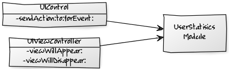
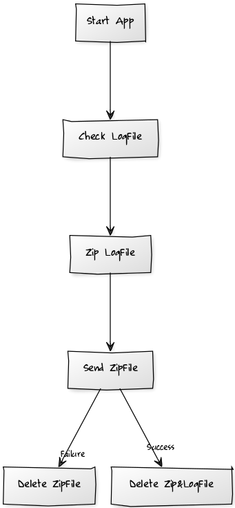
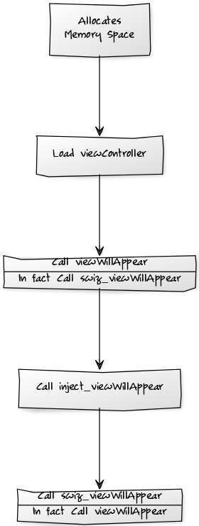

# KitAnalysisOfUserBehavior
Kit-用户行为分析模块

思路
---

###1.采集数据



1. 利用Hook分别在`UIViewController`和`UIControl`中注入用户行为分析采集代码
2. 把采集到的数据存储在Sandbox中

###2.发送数据



1. 启动App
2. 检查是否有昨天及之前的用户行为分析日志文件，并删除存在的所有zip文件（保证日志文件夹的正确性，不会出现不必要的zip文件）
3. 把昨天及之前的用户行为分析日志文件进行打包操作，形成zip文件
4. 上传zip文件
5. 上传成功则删除zip文件和昨天及之前的用户行为分析日志文件，上传失败则只删除zip文件。这样可以保证每次每个日志文件只能成功上传一次，且及时删除文件保持App所占内存空间不会因为日志文件而逐渐变大。

实现
---

###1.Hook通过置换函数的方式来实现代码的注入

```objectivec
// Class KitHookUtil.m

#pragma mark - 调换函数实现
+ (void) swizzlingInClass: (Class)cls originalSelector: (SEL)originalSelector swizzledSelector: (SEL)swizzledSelector {
    Class class = cls;
    Method originalMethod = class_getInstanceMethod(class, originalSelector);
    Method swizzledMethod = class_getInstanceMethod(class, swizzledSelector);
    
    BOOL didAddMethod = class_addMethod(class, originalSelector, method_getImplementation(swizzledMethod), method_getTypeEncoding(swizzledMethod));
    if (didAddMethod) {
        class_replaceMethod(class, swizzledSelector, method_getImplementation(originalMethod), method_getTypeEncoding(originalMethod));
    }
    else {
        method_exchangeImplementations(originalMethod, swizzledMethod);
    }
}
```

###2.创建一个`UIViewController`的Category，在其中进行`-viewWillAppear:`和`-viewWillDisappear:`函数的置换

`-load`函数是NSObject的函数，在其中执行函数置换，能在对象初始化的初期就执行置换操作。

`-swiz_viewWillAppear:`函数最后调用自身，这样看似会做成一个死循环，但实质并不是。由于函数已经被置换了，所以这句调用自身的语句实质上是调用原本的`-viewWillAppear:`，这样保证注入代码后，程序还能正常地继续执行下去。同理以下的`-swiz_viewWillDisappear:`也是这个道理。调用流程如下：



```objectivec
// Class UIViewController+KitUserStatisics.m

#pragma mark - load
+ (void)load {
    static dispatch_once_t onceToken;
    dispatch_once(&onceToken, ^{
        // 调换函数实现
        [KitHookUtil swizzlingInClass:[self class] originalSelector:@selector(viewWillAppear:) swizzledSelector:@selector(swiz_viewWillAppear:)];
        [KitHookUtil swizzlingInClass:[self class] originalSelector:@selector(viewWillDisappear:) swizzledSelector:@selector(swiz_viewWillDisappear:)];
    });
}

#pragma mark - 置换viewWillAppear
- (void)swiz_viewWillAppear:(BOOL)animated {
	// 代码注入
    [self inject_viewWillAppear];
    // 调回原本的函数
    [self swiz_viewWillAppear:animated];
}

#pragma mark - 置换viewWillDisappear
- (void)swiz_viewWillDisappear:(BOOL)animated {
	// 代码注入
    [self inject_viewWillDisAppear];
    // 调回原本的函数
    [self swiz_viewWillDisappear:animated];
}
```

###3.UIViewController注入代码实现

很简单，就是保存行为数据，形式为`TypeCode,TimeInterval,ClassName,Remark`，就是`行为类型,时间戳,触发类名,备注`，写入到Sandbox中，路径为`<App Sandbox>/Documents/userStatisics/xxx.log`，用户行为分析日志文件命名规则为`<yyyy-MM-dd>_userStatisics_<Device UUID>.log`

```objectivec
// Class UIViewController+KitUserStatisics.m

#pragma mark - 注入用户分析代码
#pragma mark 注入viewWillAppear
- (void) inject_viewWillAppear {
    // 保存用户分析信息
    // 用户分析信息(类型,时间,内容,备注)
    NSString *contentString = [NSString stringWithFormat:@"%@,%@,%@,%@",
                               @"1",
                               [KitUserStatisicsUtil sharedInstance].currentTimeInterval,
                               NSStringFromClass([self class]),
                               @"进入ViewController"];
    [[KitUserStatisicsUtil sharedInstance] writeUserStatisicsFileString:contentString];
}

#pragma mark 注入viewWillDisappear
- (void) inject_viewWillDisAppear {
    // 保存用户分析信息
    // 用户分析信息(类型,时间,内容,备注)
    NSString *contentString = [NSString stringWithFormat:@"%@,%@,%@,%@",
                               @"2",
                               [KitUserStatisicsUtil sharedInstance].currentTimeInterval,
                               NSStringFromClass([self class]),
                               @"离开ViewController"];
    [[KitUserStatisicsUtil sharedInstance] writeUserStatisicsFileString:contentString];
}
```

###4.创建一个`UIControl`的Category，在其中进行`-sendAction:to:forEvent:`函数的置换

原理如上述第2点。

```objectivec
// Class UIControl+KitUserStatisics.m

#pragma mark - load
+ (void)load {
    static dispatch_once_t onceToken;
    dispatch_once(&onceToken, ^{
        // 调换函数实现
        [KitHookUtil swizzlingInClass:[self class] originalSelector:@selector(sendAction:to:forEvent:) swizzledSelector:@selector(swiz_sendAction:to:forEvent:)];
    });
}

#pragma mark - 置换sendAction:to:forEvent:
- (void) swiz_sendAction:(SEL)action to:(id)target forEvent:(UIEvent *)event {
    // 代码注入
    [self inject_sendAction:action to:target forEvent:event];
    // 调回原本的函数
    [self swiz_sendAction:action to:target forEvent:event];
}
```

###5.UIControl注入代码实现

和第3点一样，数据形式也很简单，保存行为数据，形式为`TypeCode,TimeInterval,BehaviorData,Remark`，就是`行为类型,时间戳,行为数据,备注`。

其中`BehaviorData(行为数据)`包括`UIControlClassName|TargetClassName|ActionFunctionName|UIControlTag|UIControlFrame|UIControlInfo`，即`控件类名|Target对应的类名|Action函数名|控件Tag值|控件Frame值|控件属性`。

其中`UIControlInfo(控件属性)`会由不同控件而不同。在iOS中继承`UIControl`的有以下控件：

- UIButton
- UISegmentedControl
- UITextField
- UISlider
- UISwitch
- UIPageControl
- UIStepper
- UIDatePicker

由于需要控件调用了`-addTarget:action:forControlEvents:`才能捕捉到行为数据，所以这里只做其中`UIButton`、`UISegmentedControl`、`UISlider`、`UISwitch`、`UIStepper`5种控件的行为分析，因为这5种控件通常都会调用`-addTarget:action:forControlEvents:`，其它UIControl控件就要视是否调用`-addTarget:action:forControlEvents:`函数了。

而这5种控件的`控件属性`会有所不同

- UIButton 				：保存titleLabel.text
- UISegmentedControl 	：保存选中的文本或Index值
- UISlider 				：保存滑动的值
- UISwitch 				：保存“isOn”或者“isOff”状态
- UIStepper 			：保存Stepper.value

```objectivec
// Class UIControl+KitUserStatisics.m

#pragma mark - 注入用户分析代码
#pragma mark 注入sendAction中
- (void) inject_sendAction:(SEL)action to:(id)target forEvent:(UIEvent *)event {
    // 保存用户分析信息
    if ([self isKindOfClass:[UIButton class]]) {
        // UIButton
        // 用户分析信息(类型,时间,内容,备注)
        NSString *contentString = [NSString stringWithFormat:@"%@,%@,%@,%@",
                                   @"100",
                                   [KitUserStatisicsUtil sharedInstance].currentTimeInterval,
                                   [NSString stringWithFormat:@"%@|%@|%@|%ld|%@|%@",
                                    NSStringFromClass([self class]),
                                    NSStringFromClass([target class]),
                                    NSStringFromSelector(action),
                                    (long)self.tag,
                                    NSStringFromCGRect(self.frame),
                                    ((UIButton*)self).titleLabel.text ? ((UIButton*)self).titleLabel.text: @""],
                                   @"UIButton点击事件"];
        [[KitUserStatisicsUtil sharedInstance] writeUserStatisicsFileString:contentString];
    }
    else if ([self isKindOfClass:[UISegmentedControl class]]) {
        // UISegmentedControl
        // 获取选中的标题，没有标题获取index值
        UISegmentedControl *tempSc = (UISegmentedControl*)self;
        NSInteger selectedSegmentIndex = tempSc.selectedSegmentIndex;
        NSString *selectedSegmentTitle = [tempSc titleForSegmentAtIndex:selectedSegmentIndex];
        selectedSegmentTitle = selectedSegmentTitle == nil || selectedSegmentTitle.length == 0 ? [NSString stringWithFormat:@"%ld", selectedSegmentIndex] : selectedSegmentTitle;
        // 用户分析信息(类型,时间,内容,备注)
        NSString *contentString = [NSString stringWithFormat:@"%@,%@,%@,%@",
                                   @"101",
                                   [KitUserStatisicsUtil sharedInstance].currentTimeInterval,
                                   [NSString stringWithFormat:@"%@|%@|%@|%ld|%@|%@",
                                    NSStringFromClass([self class]),
                                    NSStringFromClass([target class]),
                                    NSStringFromSelector(action),
                                    (long)self.tag,
                                    NSStringFromCGRect(self.frame),
                                    selectedSegmentTitle ? selectedSegmentTitle : @""],
                                   @"UISegmentedControl选择事件"];
        [[KitUserStatisicsUtil sharedInstance] writeUserStatisicsFileString:contentString];
    }
    else if ([self isKindOfClass:[UISlider class]]) {
        // UISlider
        // 用户分析信息(类型,时间,内容,备注)
        NSString *contentString = [NSString stringWithFormat:@"%@,%@,%@,%@",
                                   @"102",
                                   [KitUserStatisicsUtil sharedInstance].currentTimeInterval,
                                   [NSString stringWithFormat:@"%@|%@|%@|%ld|%@|%f",
                                    NSStringFromClass([self class]),
                                    NSStringFromClass([target class]),
                                    NSStringFromSelector(action),
                                    (long)self.tag,
                                    NSStringFromCGRect(self.frame),
                                    ((UISlider*)self).value],
                                   @"UISlider选择事件"];
        [[KitUserStatisicsUtil sharedInstance] writeUserStatisicsFileString:contentString];
        
    }
    else if ([self isKindOfClass:[UISwitch class]]) {
        // UISwitch
        // 用户分析信息(类型,时间,内容,备注)
        NSString *contentString = [NSString stringWithFormat:@"%@,%@,%@,%@",
                                   @"103",
                                   [KitUserStatisicsUtil sharedInstance].currentTimeInterval,
                                   [NSString stringWithFormat:@"%@|%@|%@|%ld|%@|%@",
                                    NSStringFromClass([self class]),
                                    NSStringFromClass([target class]),
                                    NSStringFromSelector(action),
                                    (long)self.tag,
                                    NSStringFromCGRect(self.frame),
                                    ((UISwitch*)self).isOn ? @"isOn" : @"isOff"],
                                   @"UISwitch选择事件"];
        [[KitUserStatisicsUtil sharedInstance] writeUserStatisicsFileString:contentString];
    }
    else if ([self isKindOfClass:[UIStepper class]]) {
        // UIStepper
        // 用户分析信息(类型,时间,内容,备注)
        NSString *contentString = [NSString stringWithFormat:@"%@,%@,%@,%@",
                                   @"104",
                                   [KitUserStatisicsUtil sharedInstance].currentTimeInterval,
                                   [NSString stringWithFormat:@"%@|%@|%@|%ld|%@|%f",
                                    NSStringFromClass([self class]),
                                    NSStringFromClass([target class]),
                                    NSStringFromSelector(action),
                                    (long)self.tag,
                                    NSStringFromCGRect(self.frame),
                                    ((UIStepper*)self).value],
                                   @"UIStepper选择事件"];
        [[KitUserStatisicsUtil sharedInstance] writeUserStatisicsFileString:contentString];
    }
    else {
        // 其它
        // 用户分析信息(类型,时间,内容,备注)
        NSString *contentString = [NSString stringWithFormat:@"%@,%@,%@,%@",
                                   @"105",
                                   [KitUserStatisicsUtil sharedInstance].currentTimeInterval,
                                   [NSString stringWithFormat:@"%@|%@|%@|%ld|%@|%@",
                                    NSStringFromClass([self class]),
                                    NSStringFromClass([target class]),
                                    NSStringFromSelector(action),
                                    (long)self.tag,
                                    NSStringFromCGRect(self.frame),
                                    @""],
                                   @"其它UIControl事件"];
        [[KitUserStatisicsUtil sharedInstance] writeUserStatisicsFileString:contentString];
    }
}
```

###6.创建一个`UITabBarController`的Category，在其中进行`-setSelectedViewController:`函数的置换
原理如上述第2点。

```objectivec
// Class UITabBarController+KitUserStatisics.m

#pragma mark - load
+ (void)load {
    static dispatch_once_t onceToken;
    dispatch_once(&onceToken, ^{
        // 调换函数实现
        [KitHookUtil swizzlingInClass:[self class] originalSelector:@selector(setSelectedViewController:) swizzledSelector:@selector(swiz_setSelectedViewController:)];
    });
}

#pragma mark - 置换swiz_setSelectedViewController:
- (void) swiz_setSelectedViewController: (__kindof UIViewController *)selectedViewController {
    // 代码注入
    [self inject_setSelectedViewController:selectedViewController];
    // 调回原本的函数
    [self swiz_setSelectedViewController:selectedViewController];
}
```

###7.UITabBarController注入代码实现

和第3点一样，数据形式也很简单，保存行为数据，形式为`TypeCode,TimeInterval,ClassName,Remark`，就是`行为类型,时间戳,触发类名,备注`。

首次进入应用后不会触发第一个Tabbar的统计，切换到不同Tabar时统计进入对应ViewController的数据。

```objectivec
// Class UIControl+KitUserStatisics.m

#pragma mark - 注入用户分析代码
#pragma mark 注入setSelectedViewController:中
- (void) inject_setSelectedViewController: (__kindof UIViewController *)selectedViewController {
    // 保存用户分析信息
    // 用户分析信息(类型,时间,内容,备注)
    NSString *contentString = [NSString stringWithFormat:@"%@,%@,%@,%@",
                               @"3",
                               [KitUserStatisicsUtil sharedInstance].currentTimeInterval,
                               NSStringFromClass([selectedViewController class]),
                               @"Tabbar切换ViewController"];
    [[KitUserStatisicsUtil sharedInstance] writeUserStatisicsFileString:contentString];
}
```

###8.发送用户行为日志文件

在每次App启动的时候进行用户行为日志文件进行压缩并上传操作，实现方式也是通过Hook方式把上传代码注入到AppDelegate中。

```objectivec
// Class AppDelegate+KitUserStatisics.m

#pragma mark - load
+ (void)load {
    static dispatch_once_t onceToken;
    dispatch_once(&onceToken, ^{
        [KitHookUtil swizzlingInClass:[self class] originalSelector:@selector(application:didFinishLaunchingWithOptions:) swizzledSelector:@selector(swiz_application:didFinishLaunchingWithOptions:)];
    });
}

#pragma mark - 置换application:didFinishLaunchingWithOptions:
- (BOOL)swiz_application:(UIApplication *)application didFinishLaunchingWithOptions:(NSDictionary *)launchOptions {
    [self inject_application:application didFinishLaunchingWithOptions:launchOptions];
    return [self swiz_application:application didFinishLaunchingWithOptions:launchOptions];
}

#pragma mark - 注入代码
- (void) inject_application:(UIApplication *)application didFinishLaunchingWithOptions:(NSDictionary *)launchOptions {
    // 压缩用户日志文件
    [[KitUserStatisicsUtil sharedInstance] zipUserStatiscsFile];
    // 发送用户日志压缩文件
    [[KitUserStatisicsUtil sharedInstance] sendUserStatisicsFiles];
}
```

依赖
---

###1. iOS Framework
- libz.tbd
- Security.framework

###2.第三方框架
由于使用到Zip压缩和网络文件上传，所以会依赖2个第三方框架

- SSZipArchive：Zip压缩框架
- AFNetworking: 网络框架

使用
---

1. 导入依赖框架（SSZipArchive和AFNetworking）
2. 导入libz.tbd和Security.framework
3. 导入`KitUserStatisics`文件夹
4. 修改其中`KitUserStatisicsInfo.plist`中的`UploadFileURL`属性，指定上传文件接口

只需四步，就能接入该用户行为分析框架。

数据说明
---

###1.用户行为日志格式--文件头设备信息说明

例子：`iPhone Simulator,Simulator,iPhone OS,9.1,CD392B37-7B30-471B-8D40-5D4E7D243369,1.0,1`

|序号|字段名|说明|默认值|
|:---:|:---|:---|:---|
|1|deviceName|设备名称||
|2|deviceModel|设备型号||
|3|systemName|系统名称||
|4|systemVersion|系统版本||
|5|uuid|设备唯一标识||
|6|appVersion|应用版本||
|7|appBuild|应用Build值||

###2.用户行为日志格式--UIViewController行为

例子：`1,1473302682,ViewController,进入ViewController`

|序号|字段名|说明|默认值|
|:---:|:---|:---|:---|
|1|TypeCode|行为类型||
|2|TimeInterval|时间戳||
|3|ClassName|触发类名||
|4|Remark|备注||

###3.用户行为日志格式--UIControl行为

例子：`100,1473302950,UIButton|ViewController|buttonAction:|0|{{0, 100}, {100, 100}}|commitButton,UIButton点击事件`

|序号|字段名|说明|默认值|
|:---:|:---|:---|:---|
|1|TypeCode|行为类型||
|2|TimeInterval|时间戳||
|3|BehaviorData|行为数据||
|4|Remark|备注||

BehaviorData：`UIControlClassName|TargetClassName|ActionFunctionName|UIControlTag|UIControlFrame|UIControlInfo`，即`控件类名|Target对应的类名|Action函数名|控件Tag值|控件Frame值|控件属性`

####3.1.用户行为日志格式--UIControl行为中UIControlInfo

例子：`UIButton|ViewController|buttonAction:|0|{{0, 100}, {100, 100}}|commitButton`

|序号|控件|字段名|说明|默认值|
|:---:|:---|:---|:---|:---|
|1|UIButton|titleLabel.text|按钮内文本||
|2|UISegmentedControl|selectedSegmentTitle或selectedSegmentIndex|选中文本或索引||
|3|UISlider|value|滑动值||
|4|UISwitch|isOn或isOff|开或关的状态||
|5|UIStepper|value|Stepper的值||
|6|其他UIControl|空|空|@""|

###4.用户行为日志格式--TypeCode(行为类型)

|序号|代码|说明|
|:---:|:---|:---|
|1|0～99|启动App／UIViewController页面行为|
|1|100～199|UIControl点击行为|

|序号|代码|说明|
|:---:|:---|:---|
|0|0|启动App|
|1|1|进入页面行为|
|2|2|离开页面行为|
|3|3|Tabbar切换页面行为|
|3|100|UIButton点击行为|
|4|101|UISegmentedControl选择行为|
|5|102|UISlider滑动行为|
|6|103|UISwitch开关行为|
|7|104|UISteppe值变化行为|
|8|105|其他UIControl对应操作行为|
